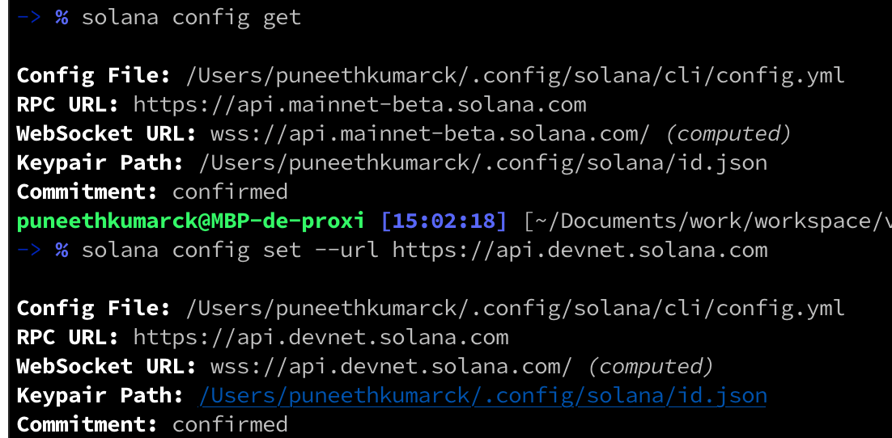
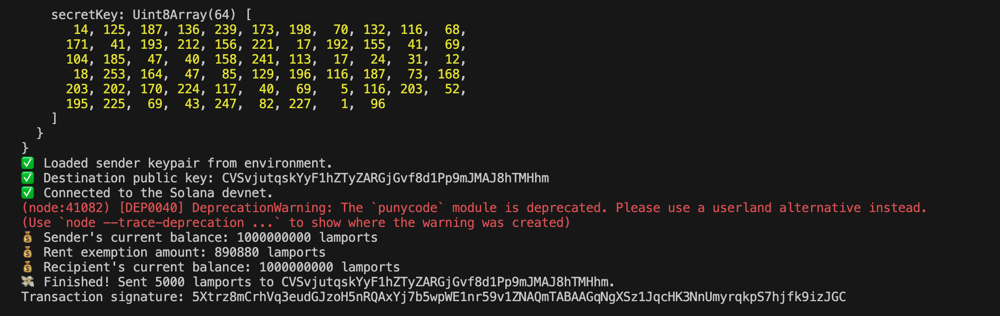
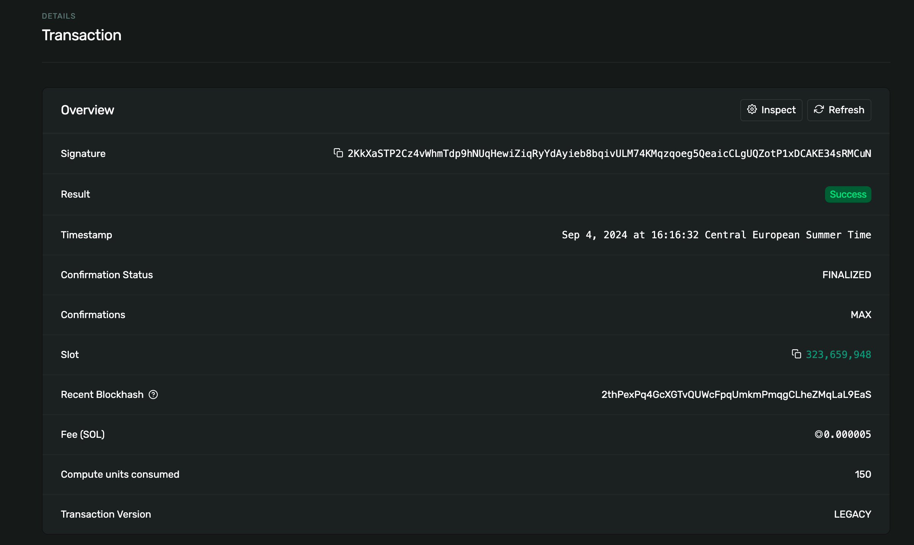

# Solana Transaction Script

This project provides a Node.js script to facilitate sending SOL (Solana's cryptocurrency) from one account to another on the Solana blockchain using the Solana Web3.js SDK. The script handles connecting to the Solana network, loading keypairs from environment variables, validating public keys, and checking balances before sending the transaction.

## Features

- **Connect to Solana Network**: Supports devnet, testnet, and mainnet-beta clusters.
- **Load Keypairs**: Loads the sender's keypair from an environment variable for security.
- **Balance Check**: Checks the balances of both sender and recipient accounts before initiating a transaction.
- **Airdrop Request**: Requests airdrops to top up balances for testing on the devnet.
- **Transaction Creation**: Constructs and sends a transaction to transfer SOL between accounts.

## Prerequisites

Before running the script, ensure that you have the following:

- Node.js installed on your machine.

- A Solana CLI installed and set up.
- A `.env` file with the sender's `SECRET_KEY` in base64 or JSON format (steps to generate a keypair below).
- Solana Web3.js SDK installed (`@solana/web3.js`).
- An internet connection to connect to the Solana network.

### 1. Generate a Keypair

To create a new keypair for your Solana account, use the `solana-keygen` command:

```bash
solana config get
solana config set --url https://api.devnet.solana.com
solana-keygen new --outfile ~/my-keypair.json
```



This will generate a new keypair and store it in `my-keypair.json`. You can find the public key by running:

```bash
solana-keygen pubkey ~/my-keypair.json
```

### 2. Fund Your Account

You can use the Solana Devnet to get test funds for your account. Use the `solana airdrop` command to send 1 SOL to your account:

```bash
solana airdrop 1 <your-public-key> --url https://api.devnet.solana.com
```

If you need more funds, you can request additional airdrops.

## Installation

1. Clone this repository:

```bash
git clone https://github.com/Puneethkumarck/solana-web3-bootcamp.git
```

2. Install dependencies:

```bash
   cd solana-web3-bootcamp
   npm install
```

3. Create a `.env` file in the root of your project and add the `SECRET_KEY` environment variable:

```bash
   SECRET_KEY=<your_base64_or_json_secret_key>
```

## Usage

To execute the script, you need to provide the recipient's public key as a command-line argument.

### Example:

```bash
npx tsc transfer.ts <recipient-public-key>
```

For example:

```bash
npx tsc transfer.ts GFC68tMFVSEodZVsCoW1Do4tAeL9j7WVVggtQXBJqSE2
```




## Key Functions

- **`createConnection(cluster)`**: Connects to the Solana network.
- **`loadSenderKeypair()`**: Loads the sender's keypair from the environment variable.
- **`isValidPublicKey(pubkey)`**: Validates if the supplied string is a valid Solana public key.
- **`getAccountBalance(connection, publicKey)`**: Retrieves the balance of the specified account.
- **`createTransaction(fromPubkey, toPubkey, lamports)`**: Creates a transaction to transfer SOL.
- **`main()`**: Main function that runs the script and handles the entire transaction process.

## Error Handling

The script checks for common issues such as:

- Invalid public keys.
- Insufficient funds for rent exemption or transactions.
- Failed network or transaction issues.

## Airdrop Feature

On the Solana devnet, the script requests an airdrop for both the sender and recipient if their balances are too low to perform the transaction or to meet rent exemption requirements.

## Logging

The script logs key steps, such as:

- Loading of keypair.
- Connection to the network.
- Balance checks.
- Transaction progress and any errors encountered.


## References
[Solana Devnet Explorer](https://explorer.solana.com/?cluster=devnet)  
[Solana Devnet Faucet](https://faucet.solana.com/)  
[Solana Development Guides](https://www.quicknode.com/guides/tags/solana)